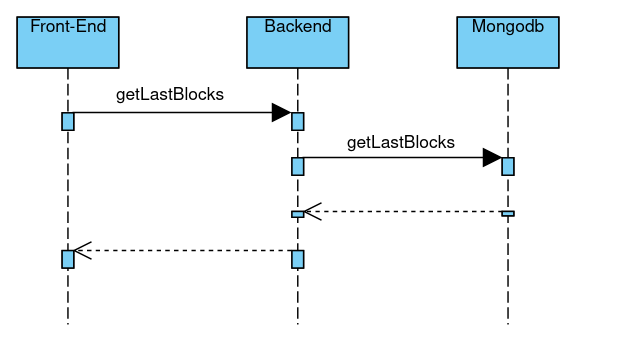
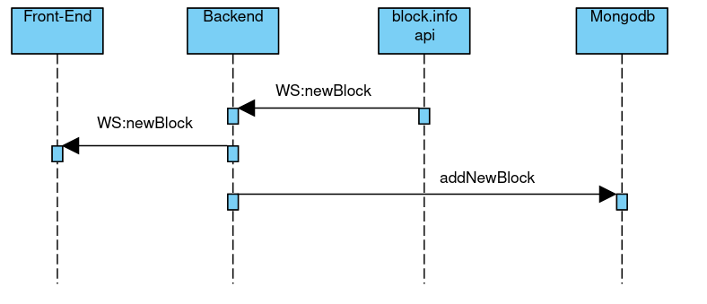

# Blockinfo

This is a simple btc blockinfo repo using reactjs.

It displays basic infos about recent blocks, register theses infos to a mongodb.

It can display tx details of a specific block.

# Files

serverExpress.js is the backend.
- It connects to blockchain.info websocket to get new block info.
- When a new block is received, it updates front-end clients through another websocket
- It registers new block info to a mongodb

blockchain.info websocket only provides meta info about a btc block, not the txs present in the block.

reactjs is the front-end.
- At the main page, it asks mongodb ( trough backend ) to get info of last 20 blocks
- It auto-updates when receiving new block info through backend's websocket 
- When clicking to a specific block, it asks blockchain.info api to get txs of that specific block and displays it.

proxy.js is a proxy used to avoid cors errors. 

# Sequence Diagram

Mongodb calls diagram :

Websockets calls diagram :

